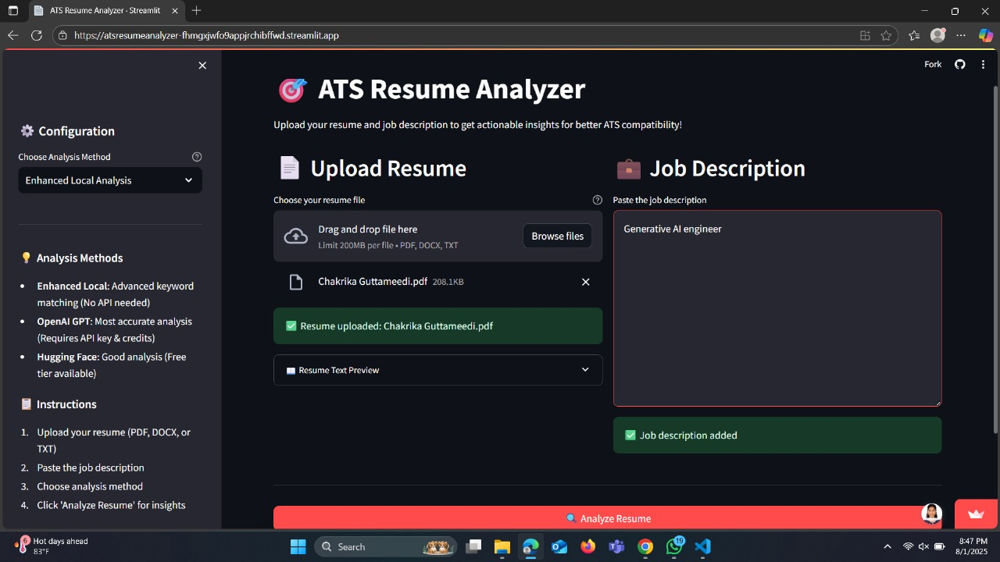
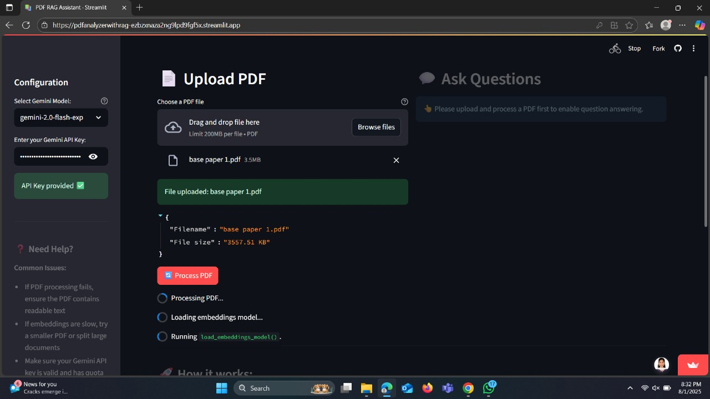

# 🎯 ATS Resume Analyzer

A powerful web application built with Streamlit that analyzes resumes against job descriptions to provide actionable insights for better ATS (Applicant Tracking System) compatibility.

## 🚀 Live Demo

**[Try the live application here](https://atsresumeanalyzer-fhmgxjwfo9appjrchibffwd.streamlit.app/)**


## 🌟 Features

- **Multi-format Support**: Upload resumes in PDF, DOCX, or TXT formats
- **Advanced Analysis**: Three analysis methods including local enhanced analysis, OpenAI GPT, and Hugging Face
- **Role-specific Skills Detection**: Identifies skills for 40+ different job roles including:
  - Software Development (Java, Python, Frontend, Backend, Full-stack, etc.)
  - AI/ML/Data Science (GenAI, ML Engineer, Data Scientist, etc.)
  - DevOps/Cloud (AWS, Azure, Kubernetes, etc.)
  - Engineering (Mechanical, Civil, Electrical, etc.)
  - QA/Testing, Cybersecurity, Product Management, and more
- **Comprehensive Scoring**: ATS score out of 100 with detailed breakdown
- **Skills Gap Analysis**: Identifies missing skills and provides recommendations
- **Keyword Matching**: Analyzes keyword alignment with job requirements
- **Interactive Dashboard**: Clean, modern UI with tabbed results presentation


## 📋 Requirements

```
streamlit==1.28.1
PyPDF2==3.0.1
python-docx==0.8.11
requests==2.31.0
openai==1.23.6
```

## 🛠️ Installation

1. **Clone the repository**
   ```bash
   git clone <your-repository-url>
   cd ats-resume-analyzer
   ```

2. **Install dependencies**
   ```bash
   pip install -r requirements.txt
   ```

3. **Run the application**
   ```bash
   streamlit run app.py
   ```

4. **Open your browser** and navigate to `http://localhost:8501`

## 🎮 How to Use

1. **Upload Your Resume**: Choose a PDF, DOCX, or TXT file containing your resume
2. **Paste Job Description**: Copy and paste the complete job description you're targeting
3. **Select Analysis Method**:
   - **Enhanced Local Analysis**: Advanced keyword matching (No API required)
   - **OpenAI GPT**: Most accurate analysis (Requires API key & credits)
   - **Hugging Face**: Good analysis (Free tier available)
4. **Analyze**: Click "Analyze Resume" to get comprehensive insights
5. **Review Results**: Explore the detailed analysis across multiple tabs

## 📊 Analysis Features

### ATS Score Metrics
- **ATS Score**: Overall compatibility score (0-100)
- **Keyword Match**: Percentage of job keywords found in resume
- **Missing Skills**: Count of critical skills not found

### Detailed Analysis Tabs
1. **Skills Analysis**: Required vs. found vs. missing skills breakdown
2. **Recommendations**: Actionable suggestions for improvement
3. **Strengths & Weaknesses**: Detailed pros and cons analysis
4. **Overall Feedback**: Comprehensive summary and next steps

## 🎯 Supported Job Roles

The analyzer intelligently detects and analyzes for 40+ job roles including:

### Software Development
- Java Developer, Python Developer, Frontend Developer
- Backend Developer, Full-stack Developer, Mobile Developer
- .NET Developer, Golang Developer, C++ Developer

### AI/ML/Data
- Generative AI Engineer, AI/ML Engineer, Data Scientist
- Data Engineer, Data Analyst, Computer Vision Engineer
- NLP Engineer

### DevOps/Cloud
- DevOps Engineer, Cloud Engineer, AWS/Azure Engineer
- Site Reliability Engineer (SRE)

### Engineering
- Mechanical Engineer, Civil Engineer, Electrical Engineer
- Embedded Systems Engineer, Software Engineer

### Other Roles
- QA Engineer, Cybersecurity Engineer, Product Manager
- UI/UX Designer, Digital Marketing, Sales Engineer

## 🔧 Configuration Options

### Analysis Methods
- **Enhanced Local Analysis**: Uses advanced pattern matching and role-specific skill databases
- **OpenAI GPT**: Leverages GPT-3.5-turbo for intelligent analysis (requires API key)
- **Hugging Face**: Uses Hugging Face models for analysis (optional API key)

### API Keys
- OpenAI API key for GPT analysis
- Hugging Face API key for enhanced model access (optional)

## 🖼️ Outputs

### Application Interface

*Main interface showing resume upload, job description input, and configuration options*

### Analysis Results

*Detailed analysis results with ATS score, skills breakdown, and recommendations*

## 🔒 Privacy & Security

- All document processing happens locally or through secure API calls
- No documents are stored on servers
- API keys are handled securely through Streamlit's input components
- Privacy-first approach with local processing options

## 📈 Scoring Algorithm

The ATS score is calculated based on:
- **Skills Match** (40%): Percentage of required skills found in resume
- **Keyword Alignment** (30%): Job description keyword matching
- **Role Relevance** (20%): Relevance to detected job role
- **Content Quality** (10%): Resume structure and completeness

## 🤝 Contributing

1. Fork the repository
2. Create a feature branch (`git checkout -b feature/AmazingFeature`)
3. Commit your changes (`git commit -m 'Add some AmazingFeature'`)
4. Push to the branch (`git push origin feature/AmazingFeature`)
5. Open a Pull Request

## 📄 License

This project is licensed under the MIT License - see the [LICENSE](LICENSE) file for details.

## 🆘 Support

If you encounter any issues or have questions:
1. Check the [Issues](../../issues) section
2. Create a new issue with detailed description
3. Include screenshots and error messages if applicable

## 🙏 Acknowledgments

- Built with [Streamlit](https://streamlit.io/) for the web interface
- Uses [PyPDF2](https://pypdf2.readthedocs.io/) for PDF processing
- Integrates with [OpenAI API](https://openai.com/api/) for advanced analysis
- Supports [Hugging Face](https://huggingface.co/) models for ML-based analysis

---

**Made with ❤️ for job seekers everywhere**