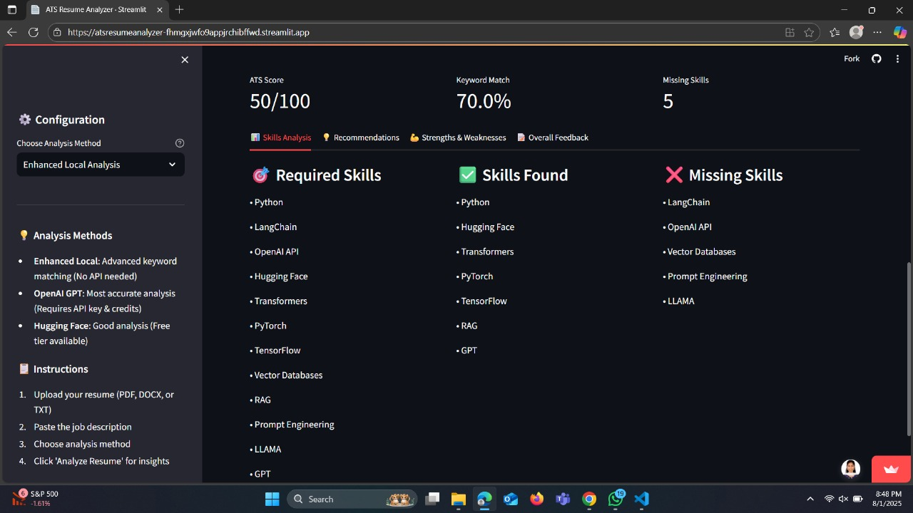

# PDF RAG Assistant 📚

A powerful Streamlit application that enables you to upload PDF documents and ask questions about their content using AI-powered Retrieval-Augmented Generation (RAG) technology.

## 🚀 Live Demo

**Try it now:** [https://pdfanalyzerwithrag-ezbzxnaza2ng9lpd9fgf5x.streamlit.app/](https://pdfanalyzerwithrag-ezbzxnaza2ng9lpd9fgf5x.streamlit.app/)

*Note: You'll need your own Gemini API key to use the live demo.*

## Features ✨

- **PDF Upload & Processing**: Upload PDF documents and extract text content
- **Intelligent Text Chunking**: Automatically splits documents into semantic chunks with overlap
- **Vector Embeddings**: Creates semantic embeddings using sentence transformers
- **Semantic Search**: Uses FAISS for efficient similarity search
- **AI-Powered Q&A**: Leverages Google Gemini models for generating contextual answers
- **Multiple Model Support**: Choose between different Gemini models (2.0 Flash, 1.5 Pro, 1.5 Flash)
- **Interactive UI**: Clean, user-friendly interface with suggested questions
- **Source Context**: View the document chunks used to generate answers
- **Session Management**: All processing happens in-memory with session state management

## Outputs 📸

The `outputs/` folder contains 4 demonstration screenshots showing the complete workflow:

### 1. Main Interface

*Initial application interface with configuration panel, API key setup, and upload section*

### 2. PDF Processing
  
*PDF processing in progress showing file upload confirmation and loading states*

### 3. Question Interface

*Successfully processed PDF with active Q&A interface and suggested questions*

### 4. Generated Answer

*AI-generated response with source context and session information*

## Installation 🚀

1. **Clone the repository**
   ```bash
   git clone <your-repo-url>
   cd pdf-rag-assistant
   ```

2. **Create a virtual environment**
   ```bash
   python -m venv venv
   source venv/bin/activate  # On Windows: venv\Scripts\activate
   ```

3. **Install dependencies**
   ```bash
   pip install -r requirements.txt
   ```

4. **Get a Gemini API key**
   - Visit [Google AI Studio](https://makersuite.google.com/app/apikey)
   - Create a new API key
   - Keep it secure for use in the application

## Usage 💡

1. **Start the application**
   ```bash
   streamlit run app.py
   ```

2. **Configure the application**
   - Enter your Gemini API key in the sidebar
   - Select your preferred Gemini model

3. **Upload and process PDF**
   - Upload a PDF file using the file uploader
   - Click "Process PDF" to extract text and create embeddings

4. **Ask questions**
   - Enable question answering with the checkbox
   - Type your question or use suggested questions
   - View AI-generated answers with source context

## Technical Architecture 🔧

### Core Components

- **Text Extraction**: PyPDF2 for extracting text from PDF files
- **Text Chunking**: Smart chunking with sentence boundary detection and overlap
- **Embeddings**: `all-MiniLM-L6-v2` sentence transformer model
- **Vector Store**: FAISS for efficient similarity search
- **AI Model**: Google Gemini for generating contextual answers
- **Frontend**: Streamlit for the web interface

### Data Flow

1. **PDF Upload** → Text extraction using PyPDF2
2. **Text Processing** → Chunking with overlap and boundary detection
3. **Embedding Generation** → Convert chunks to vector embeddings
4. **Vector Storage** → Store embeddings in FAISS index
5. **Query Processing** → Convert user question to embedding
6. **Similarity Search** → Find relevant document chunks
7. **Answer Generation** → Use Gemini to generate contextual answers

## File Structure 📁

```
pdf-rag-assistant/
├── app.py                 # Main Streamlit application
├── requirements.txt       # Python dependencies
├── README.md             # This file
└── outputs/              # Output screenshots (4 files)
    ├── 1.jpg  # Main interface
    ├── 2.jpg  # PDF processing
    ├── 3.jpg  # Q&A interface
    └── 4.jpg  # Generated answer
```

## Configuration Options ⚙️

### Gemini Models
- **gemini-2.0-flash-exp**: Fastest response, good for quick queries
- **gemini-1.5-pro**: Most capable, best for complex questions
- **gemini-1.5-flash**: Balanced speed and capability

### Processing Parameters
- **Chunk Size**: 1000 characters (configurable in code)
- **Chunk Overlap**: 200 characters (configurable in code)
- **Similar Chunks Retrieved**: 5 (configurable in code)
- **Embedding Model**: all-MiniLM-L6-v2 (cached for performance)

## Troubleshooting 🔍

### Common Issues

1. **PDF Processing Fails**
   - Ensure the PDF contains readable text (not just images)
   - Try with a different PDF file
   - Check that the file is not corrupted

2. **Slow Embedding Generation**
   - First-time model loading takes a few minutes
   - Subsequent uses are faster due to caching
   - Consider using smaller PDF files for testing

3. **API Key Issues**
   - Verify your Gemini API key is valid
   - Check that you have remaining quota
   - Ensure the key has proper permissions

4. **Memory Issues**
   - For large PDFs, consider splitting them into smaller sections
   - The application stores all data in memory during the session
   - Restart the application to clear memory if needed

### Performance Tips

- The embeddings model is cached for better performance
- Use the "Clear Session" button to reset if needed
- Smaller, focused questions often yield better results
- Try rephrasing questions if answers aren't satisfactory

## Dependencies 📦

- **streamlit**: Web application framework
- **PyPDF2**: PDF text extraction
- **google-generativeai**: Google Gemini API client
- **sentence-transformers**: Text embedding generation
- **faiss-cpu**: Efficient vector similarity search
- **numpy**: Numerical computations
- **torch**: PyTorch for transformer models

## Contributing 🤝

1. Fork the repository
2. Create a feature branch (`git checkout -b feature/amazing-feature`)
3. Commit your changes (`git commit -m 'Add some amazing feature'`)
4. Push to the branch (`git push origin feature/amazing-feature`)
5. Open a Pull Request

## License 📄

This project is licensed under the MIT License - see the LICENSE file for details.

## Acknowledgments 🙏

- Google AI for the Gemini API
- Hugging Face for the sentence transformers
- Facebook Research for FAISS
- Streamlit team for the amazing framework

## Future Enhancements 🚀

- [ ] Support for multiple file formats (DOCX, TXT, etc.)
- [ ] Batch processing of multiple PDFs
- [ ] Conversation history and chat interface
- [ ] Custom embedding model selection
- [ ] Document comparison features
- [ ] Export functionality for Q&A sessions
- [ ] Advanced filtering and search options

---

**Happy Document Analysis!** 🎉

For questions or support, please open an issue in the repository.